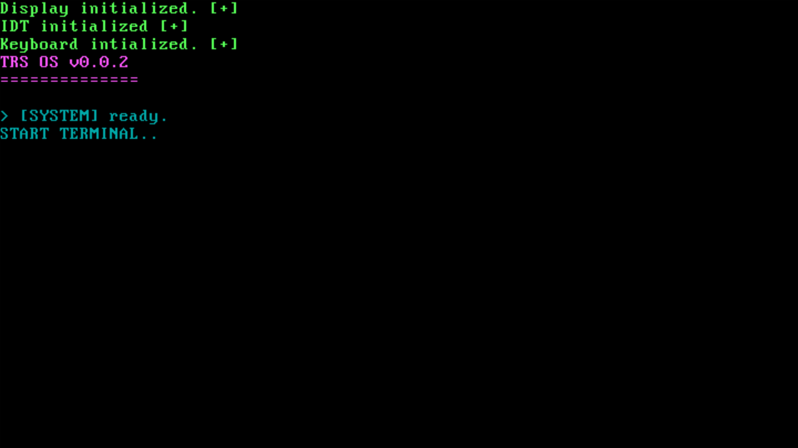

# TRS

<h3>& >> TSEZAR RELIABLE SYSTEM << &</h3>

<p>TRS __DOS__ это учебная 32-битная операционная система для архитектуры x86, написанная на чистом(<strong>ffreestanding</strong>) C и NASM. TRS ставит приоритетом надёжность, гибкость и ясность для пользователя, что и как происходит с его системой.</p>

## Планы на ОС:
- Полная прозрачность для пользователя без потери безопасности
- Работа ядра с процессами по жесткому контракту(ядро ограничивает процессу доступ к данным, памяти, CPU и проч. процесс должен изначально "попросить" у системы нужные ему ресурсы)
- Ядро будет стараться поддерживать "жизнь" системы. Предупреждая пользователя и убивая не приоритетные процессы, освобождая память и оптимизируя работу

$ Текущая версия: **0x0x2**



## Структура проекта

```
TRS/
├── bootloader/   # stage1 (boot_one.asm) и stage2 (boot_two.asm)
├── kernel/       # ядро: kmain, IDT, PIC, драйверы, стримы, linker.ld
├── libc/         # freestanding-библиотека: mem, string, mutex
├── terminal/     # терминал (в разработке)
├── trfs/         # файловая система (в разработке)
├── build/        # артефакты сборки (создаётся автоматически)
└── Makefile      # сборка, запуск и отладка
```
**Реализовано:**
- Двухстадийный загрузчик (stage1 — 1 сектор, stage2 — до 64 секторов)
- Текстовый вывод на VGA с поддержкой цветов (`driver/vga.c`)
- Таблица прерываний IDT и контроллер PIC
- Драйвер PS/2-клавиатуры
- Система потоков ввода-вывода на ring buffer (`kernel/stream.c`)
- Мини-libc: `memset` / `memcpy` / `strlen` и др., мьютексы на атомарных операциях

**В планах:**
- Терминал (shell) — `terminal/`
- Файловая система TRFS (VFS) — `trfs/`
- Менеджер памяти и пейджинг — `kernel/memory_pagging.c`
- Динамическое выделение памяти (`malloc`/`free`)


**ВДОХНОВЕНИЕ**
- https://github.com/levex/osdev
- https://youtube.com/@vividbw